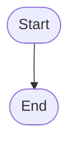
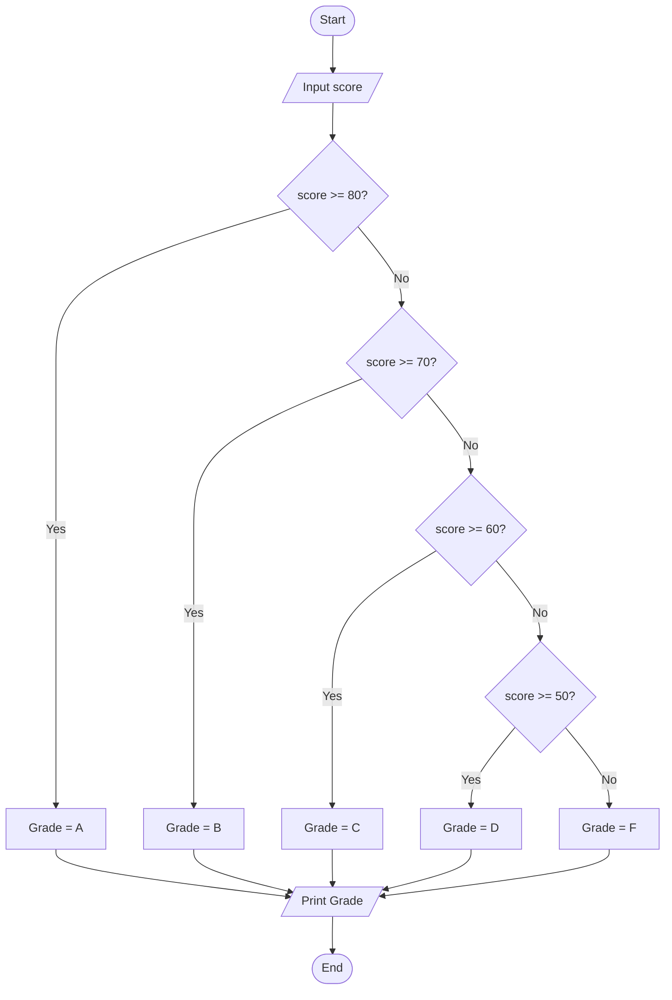
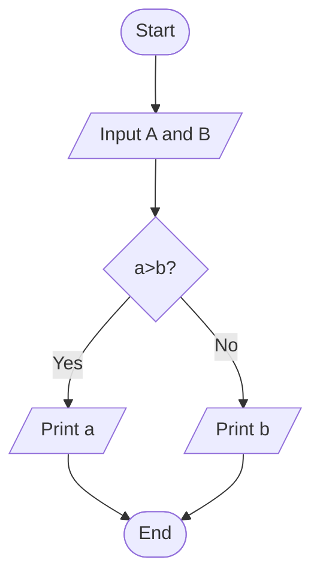
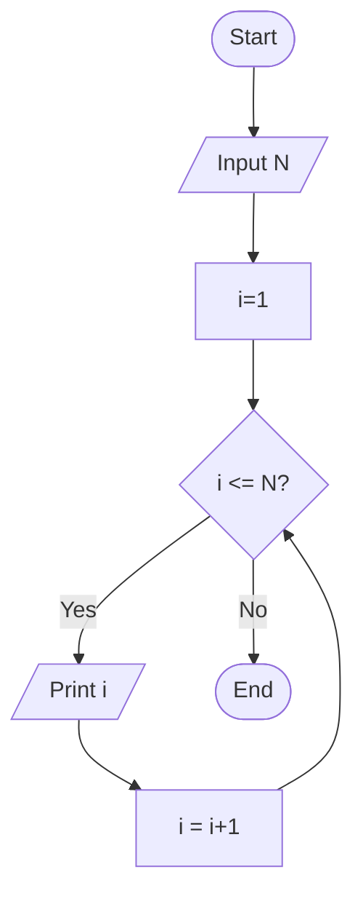

```mermaid
flowchart TD
    A([Start]) --> B([End])
```

```mermaid
flowchart TD
    Start([Start])--> Input[/Input score/]
    Input --> D1{score >= 80?}
    D1 -->|Yes| A[Grade = A]
    D1 -->|No| D2{score >= 70?}
    D2 -->|Yes| B[Grade = B]
    D2 -->|No| D3{score >= 60?}
    D3 -->|Yes| C[Grade = C]
    D3 -->|No| D4{score >= 50?}
    D4 -->|Yes| D[Grade = D]
    D4 -->|No| F[Grade = F]
    A & B & C & D & F --> Output[/Print Grade/]
    Output --> End([End])
```

```mermaid
flowchart TD
    Start([Start]) --> Input[/Input A and B/]
    Input --> D1{a>b?}
    D1 -->|Yes| a[/Print a/]
    D1 -->|No| b[/Print b/]
    a & b --> End([End])
```

```mermaid
flowchart TD
    Start([Start]) --> Input[/Input N/]
    Input --> i[i=1]
    i --> D1{i <= N?}
    D1 -->|Yes| printi[/Print i/]
    printi --> iplus[i = i+1]
    iplus --> D1{i <= N?}
    D1 -->|No| End([End])
```
