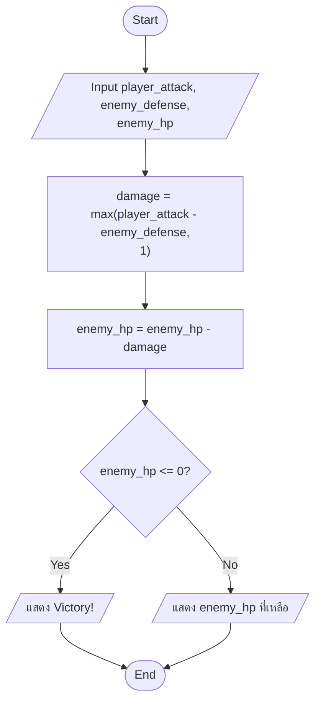
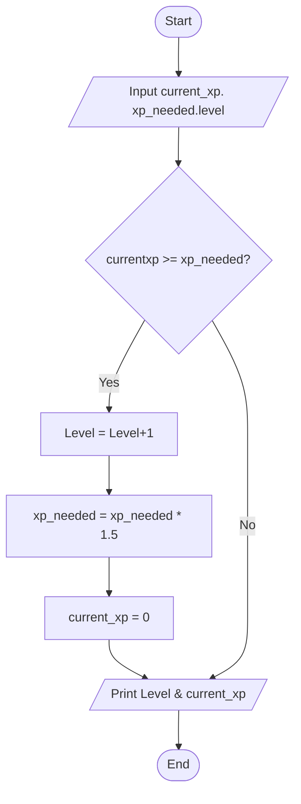

```mermaid
flowchart TD
    Start([Start]) --> Input[/Input player_attack, enemy_defense,
enemy_hp/]
    Input --> Calc["damage = max(player_attack - enemy_defense,
1)"]
    Calc --> Reduce["enemy_hp = enemy_hp - damage"]
    Reduce --> D1{enemy_hp <= 0?}
    D1 -->|Yes| Win[/แสดง Victory!/]
    D1 -->|No| Show[/แสดง enemy_hp ที่เหลือ/]
    Win & Show --> End([End])
```

```mermaid
flowchart TD
    Start([Start]) --> Input[/Input current_xp. xp_needed.level/]
    Input --> D1{currentxp >= xp_needed?}
    D1 --> |Yes| Level[Level = Level+1]
    Level --> XP_Needed[xp_needed = xp_needed * 1.5]
    XP_Needed --> Current_XP[current_xp = 0]
    Current_XP --> Output[/Print Level & current_xp /]
    D1 --> |No| Output
    Output -->End([End])
```